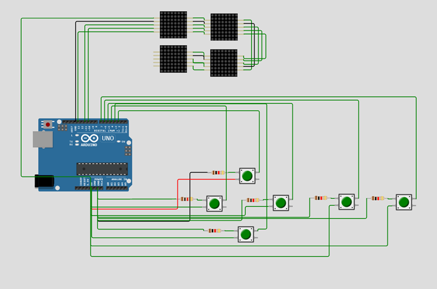
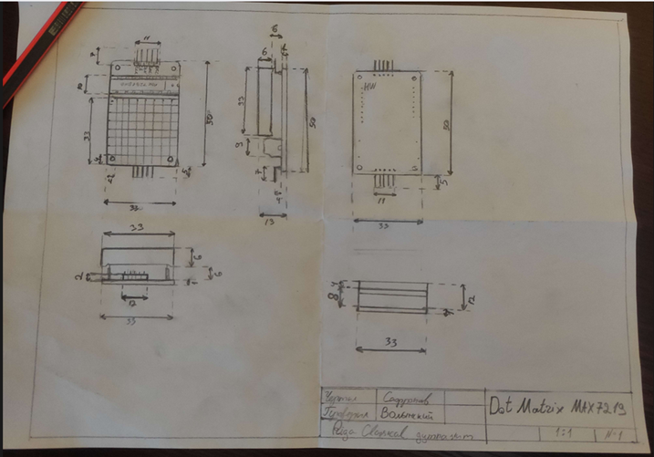
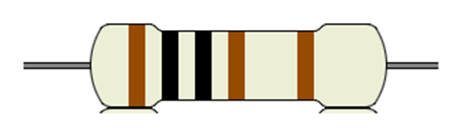

# Arduino game console

---
**Contents**
1. [Main Idea of the Project](#main-idea-of-the-project)
2. [Code for Game Console](#code-for-game-console)
3. [Scheme and Drawing](#scheme-and-drawing)
5. [Game Console Instruction](#game-console-instruction)
   - [Introduction](#introduction)
   - [Components](#components)
   - [Game Selection and Navigation](#game-selection-and-navigation)
      - [Powering On](#powering-on)
      - [Main Menu](#main-menu)
      - [Space Invaders](#space-invaders)
      - [Snake](#snake)
      - [Powering Off](#powering-off)
6. [Test Results](#test-results)

---

## Main Idea of the Project

We had an idea for a project that involves creating a compact computer game console using an LED matrix. The goal is to provide entertainment by allowing users to play old-school games on a small LED screen. The console consists of four MAX7219 8x8 matrices and six buttons for game control.

---

## Code for Game Console

You can find the Arduino code for the game console on our [GitHub repository](https://github.com/diliny867/Arduino-Game-Console-Project/blob/main/GameConsole.ino).

---

## Scheme and Drawing

**Scheme:**

**Drawing of MAX7219:**

---

## Game Console Instruction

### Introduction

The Game Console is a compact computer game console designed to provide users with a nostalgic gaming experience on a small LED screen. This documentation will guide you through the setup, operation, and functionality of the console.

### Components

1. Four MAX7219 8x8 LED Matrices: These matrices are used to display game graphics and menus.
2. Six Buttons:
   - Button 1: Move left
   - Button 2: Move up
   - Button 3: Move down
   - Button 4: Move right
   - Button 5: MAIN MOVE - Primary action button
   - Button 6: EXIT MENU - Exit to the main menu
3. Six resistors (1 kΩ ±1%)

5. Arduino wires

### Game Selection and Navigation

**Main use of buttons:**

1. At any point during gameplay or in the main menu, use the Move buttons (Button 1, Button 2, Button 3, Button 4) to navigate through the options.
2. The MAIN MOVE button (Button 5) is used for primary actions specific to each game.
3. The EXIT MENU button (Button 6) is used to exit a game and return to the main menu.

### Powering On

1. Upload the code to the computer.
2. Open the code with Arduino IDE and connect the Arduino Uno to the computer.
3. Connect all components to the Arduino Uno.
4. Upload the code to the Arduino Uno.
5. Wait for the console to boot up, and the main menu will appear on the LED screen.

### Main Menu

1. Using the Move buttons (Button 1, Button 2, Button 3, and Button 4), navigate through the available games.
2. Press the MAIN MOVE button (Button 5) to select the desired game and enter it.

### Space Invaders

1. Control the movement of the main ship to the right and left using the Move buttons (Button 1 and Button 4).
2. Press the MAIN MOVE button (Button 5) to shoot at the invading enemies.
3. Press the EXIT MENU button (Button 6) to exit the game and return to the main menu.

### Snake

1. Use the Move buttons (Button 1, Button 2, Button 3, and Button 4) to change the direction of the snake.
2. The MAIN MOVE button (Button 5) has no functionality in this game.
3. Press the EXIT MENU button (Button 6) to exit the game and go back to the main menu.

### Powering Off

1. To power off the console, unplug it from the power source.

---
## Test Results

Our game console was tested by EV and TM. During tests, we found out that there are several problems:

1. On the fourth matrix, the image can be lost:
   - It happens because the matrix doesn't receive enough power to show all bits.

2. On the fourth matrix, there are some glitches:
   - It probably happens because some wires don't make good contact as needed.

3. There are unnecessary buttons that are inactive during particular windows or games, confusing the user about their purpose.
---
